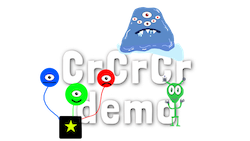
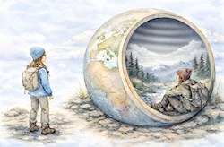
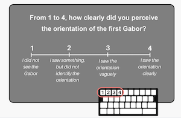
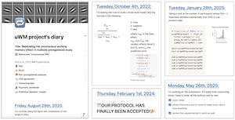
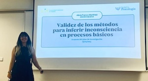
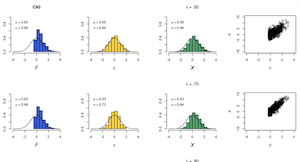
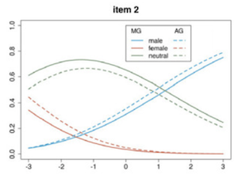
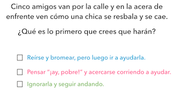

```{=html}
<!-- Video header -->
<div class="hero-video">
  <video autoplay muted loop playsinline>
    <source src="assets/publications.mp4" type="video/mp4">
  </video>
  <div class="hero-text">
  <h1>Researcher</h1>
    <p>What I’ve studied so far…</p>
  </div>
</div>


<div class="timeline">
  <div class="timeline-item left">
    <div class="timeline-content">
      <span class="short-title">
      
  Creative Creature Creator</span>
      <div class="full-text">
      
        <h3>In progress...</h3>
        <p><strong>Franco-Martínez et al. </strong><br>
        <a href="https://osf.io/preprints/psyarxiv/xkaw6_v1"
     target="_blank"
     title="Open paper">
     🔗</a> 
     Measuring Creativity Process and Product with a Digitized Invented Alien Creatures Task.</p>
    </div>
  </div>
</div>


  <div class="timeline-item right">
    <div class="timeline-content">
      <span class="short-title">
      
  PhD Dissertation</span>
      <div class="full-text">
      
        <h3>2022-2026</h3>
        <p><strong>Alicia Franco-Martínez</strong><br>
        <a href=""
     target="_blank"
     title="Open paper">
     🔗</a> 
     Be(a)ware of Validity: Inferences and Measures in Unconscious Processing Research.</p>
    </div>
  </div>
</div>

  <div class="timeline-item left">
    <div class="timeline-content">
      <span class="short-title">
      
  Validity of the PAS</span>
      <div class="full-text">
      
        <h3>Under review...</h3>
        <p><strong>Franco-Martínez et al. </strong><br>
        <a href="https://osf.io/jd7ak/overview"
     target="_blank"
     title="Open paper">
     🔗</a> 
     Choose your own PAS? Quantitative and qualitative validity evidence for the Perceptual Awareness Scale.</p>
    </div>
  </div>
</div>

  <div class="timeline-item right">
    <div class="timeline-content">
      <span class="short-title">
      
      Resources for multisite studies</span>
      <div class="full-text">
      
      <h3>2026</h3>
      <p><strong>Franco-Martínez & Vadillo </strong><br> 
      <a href="https://doi.org/10.1525/collabra.159983"
     target="_blank"
     title="Open paper">
     🔗</a> A gentle push toward leading your first multisite Registered Report: Resources and recommendations from an early-career coordinator</p>
    </div>
  </div>
</div>


  <div class="timeline-item left">
    <div class="timeline-content">
      <span class="short-title">
      
       Replicating unconscious WM effect</span>
      <div class="full-text">
      
      <h3>2026</h3>
      <p><strong>Franco-Martínez et al. </strong><br>
      <a href="https://academic.oup.com/nc/article-abstract/2026/1/niaf046/8429939"
     target="_blank"
     title="Open paper">
     🔗</a> Replicating the unconscious Working Memory effect: A multisite Registered Report</p>
      <p><em>Neuroscience of Consciousness</em></p>
    </div>
  </div>
</div>

  <div class="timeline-item right">
    <div class="timeline-content">
      <span class="short-title">
      
      COS project</span>
      <div class="full-text">
      
      <h3>2022-2026</h3>
      <p><strong>Principal Investigator</strong> $36.813<br>
      <a href="https://osf.io/nz6m5/overview"
     target="_blank"
     title="Open link">
     🔗</a> Replicating the unconscious Working Memory effect: A multisite Registered Report</p>
      <p><a href="https://www.cos.io/consciousness"
     target="_blank"
     title="Open paper">
     
     </a> <em>Center for Open Science</em></p>
    </div>
  </div>
</div>

  <div class="timeline-item left">
    <div class="timeline-content">
      <span class="short-title">
      
      Modeling measurement and sampling noise</span>
      <div class="full-text">
      
      <h3>2025</h3>
      <p><strong>Franco-Martínez et al. </strong><br>
        <a href="https://www.sciencedirect.com/science/article/pii/S0749596X25000142"
     target="_blank"
     title="Open paper">
     🔗</a> Measurement and sampling noise undermine inferences about awareness in location probability learning
      <p><em>Journal of Memory and Language</em></p>
    </div>
  </div>
</div>

  <div class="timeline-item right">
    <div class="timeline-content">
      <span class="short-title">
      
      My PhD starts...</span>
      <div class="full-text">
      
      <h3>2022-2026</h3>
      <p><strong>FPI-MINECO</strong><br>
       </a>Validity of the methods to infer unconsciousness in psychological processes
      <p><em>Autonomous University of Madrid</em></p>
    </div>
  </div>
</div>

  <div class="timeline-item left">
    <div class="timeline-content">
      <span class="short-title">
      
      Range restriction affects Factor Analysis</span>
      <div class="full-text">
      
      <h3>2023</h3>
      <p><strong>Franco-Martínez et al. </strong><br> 
        <a href="https://pubmed.ncbi.nlm.nih.gov/36866065/"
     target="_blank"
     title="Open paper">
     🔗</a>Range Restriction affects Factor Analysis: Normality, estimation, fit, loadings, and reliability</p>
      <p><em>Educational and Psychological Measurement</em></p>
    </div>
  </div>
</div>

  <div class="timeline-item right">
    <div class="timeline-content">
      <span class="short-title">
      
      Nominal Factor Analysis</span>
      <div class="full-text">
      
      <h3>2021</h3>
      <p><strong>Revuelta et al. </strong><br> 
        <a href="https://pubmed.ncbi.nlm.nih.gov/34565816/"
     target="_blank"
     title="Open paper">
     🔗</a>Nominal Factor Analysis of Situational Judgment Tests: Evaluation of Latent Dimensionality and Factorial Invariance</p>
      <p><em>Educational and Psychological Measurement</em></p>
    </div>
  </div>
</div>
  
  
  <div class="timeline-item left">
    <div class="timeline-content">
      <span class="short-title">
      
      Master's in Methodology of Behavoural Sciences (UAM)</span>
      <div class="full-text">
      
      <h3>2014-2019</h3>
      <p><strong>Autonomous University of Madrid </strong><br>
    </div>
  </div>
</div>

  
  <div class="timeline-item right">
    <div class="timeline-content">
      <span class="short-title">
      
      Masculine generic</span>
      <div class="full-text">
      
      <h3>2019</h3>
      <p><strong>Franco-Martínez </strong><br>
        <a href="https://osf.io/7azfg/overview"
     target="_blank"
     title="Open paper">
     🔗</a> ¿Todos, todos/as, todxs o todes? Efectos cognitivos del uso del genérico masculino y sus formas alternativas en español.</p>
      <p><em>Book chapter: Egales</em></p>
    </div>
  </div>
</div>

  <div class="timeline-item left">
    <div class="timeline-content">
      <span class="short-title">
      
      Bachelor in Psychology (UAM)</span>
      <div class="full-text">
      
      <h3>2014-2019</h3>
      <p><strong>Autonomous University of Madrid </strong><br>
    </div>
  </div>
</div>
</div>

<script>
(() => {
  const timeline = document.querySelector('.timeline');
  if (!timeline) return;

  const WRAP_MARGIN = 120;
  const TAIL_START_OFFSET = 48;

  let lastScrollY = window.scrollY;
  let rafId = 0;
  let adjusting = false;
  let tailStartY = 0;
  let tailEndY = 0;

  function docTop(el) {
    return el.getBoundingClientRect().top + window.scrollY;
  }

  function recomputeTailBounds() {
    const items = timeline.querySelectorAll(':scope > .timeline-item');
    if (!items.length) {
      tailStartY = 0;
      tailEndY = 0;
      return;
    }

    const last = items[items.length - 1];
    const lastTop = docTop(last);
    const lastHeight = last.getBoundingClientRect().height || 0;
    const lastBottom = lastTop + lastHeight;

    const maxY = Math.max(0, document.documentElement.scrollHeight - window.innerHeight);

    // Start loop only when viewport is already below the last item.
    tailStartY = Math.max(0, lastBottom + TAIL_START_OFFSET);
    tailEndY = Math.max(tailStartY + window.innerHeight, maxY - WRAP_MARGIN);
  }

  function maybeWrapDownward(currentY) {
    if (adjusting) return currentY;
    if (tailEndY <= tailStartY + 120) return currentY;

    const scrollingDown = currentY > lastScrollY;
    if (!scrollingDown) return currentY;

    if (currentY > tailEndY) {
      adjusting = true;
      const overflow = currentY - tailEndY;
      const resetY = tailStartY + overflow;
      window.scrollTo(0, resetY);
      adjusting = false;
      return resetY;
    }

    return currentY;
  }

  function onFrame() {
    recomputeTailBounds();
    const y = maybeWrapDownward(window.scrollY);
    lastScrollY = y;
    rafId = 0;
  }

  function onScroll() {
    if (!rafId) rafId = window.requestAnimationFrame(onFrame);
  }

  window.addEventListener('scroll', onScroll, { passive: true });
  window.addEventListener('resize', onScroll);

  recomputeTailBounds();
  onFrame();
})();
</script>


```

