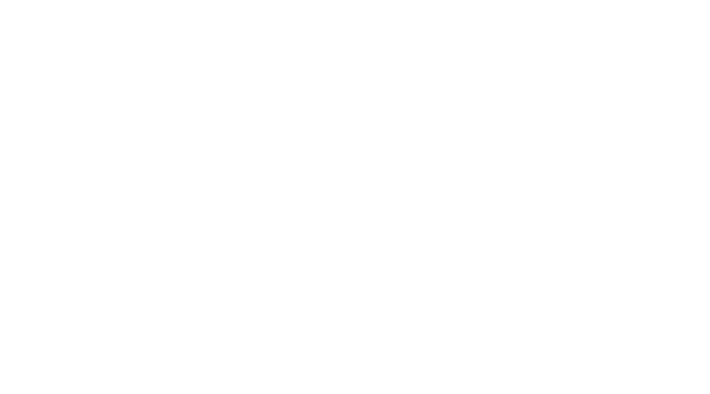
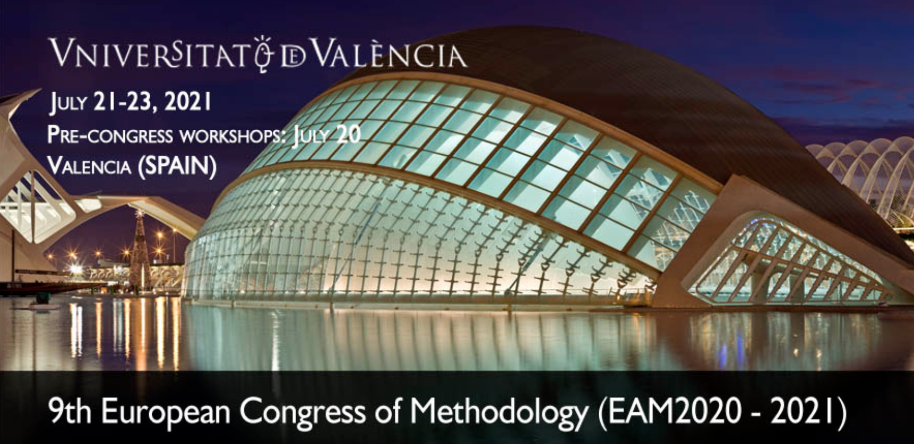

```{=html}
<div id="map-stage" aria-label="Mapa panorámico interactivo">
  <div id="map-pan">
    

    <!-- Marcador: Madrid -->
    <button class="marker" id="mk-madrid" aria-label="Madrid">
      <span class="dot" aria-hidden="true">
      
      </span>
      <span class="tip">
        
        <strong>EAM 2021</strong><br>
        Oral communication<br>
        <em>Range restriction</em>
      </span>
    </button>
  </div>
</div>

<script>
(() => {
  const stage = document.getElementById('map-stage');
  const pan   = document.getElementById('map-pan');
  const img   = document.getElementById('map-img');

  let dragging = false, startX = 0, lastX = 0;

  function setX(x){
    const stageW = stage.clientWidth;
    const panW   = pan.getBoundingClientRect().width;
    const min    = -(panW - stageW);
    const clamped = Math.max(Math.min(x, 0), min);
    pan.style.setProperty('--x', clamped + 'px');
    lastX = clamped;
  }

  function getClientX(e){ return e.touches ? e.touches[0].clientX : e.clientX; }

  function onDown(e){
    dragging = true;
    pan.style.cursor = 'grabbing';
    startX = getClientX(e) - lastX;
  }
  function onMove(e){
    if(!dragging) return;
    setX(getClientX(e) - startX);
  }
  function onUp(){ dragging = false; pan.style.cursor = 'grab'; }

  // Drag handlers
  pan.addEventListener('mousedown', onDown);
  window.addEventListener('mousemove', onMove);
  window.addEventListener('mouseup', onUp);
  pan.addEventListener('touchstart', onDown, { passive: true });
  window.addEventListener('touchmove', onMove, { passive: true });
  window.addEventListener('touchend', onUp);

  // Centrar al cargar
  function center(){ 
    const stageW = stage.clientWidth;
    const panW   = pan.getBoundingClientRect().width;
    setX((stageW - panW)/2);
  }
  window.addEventListener('load', center);
  window.addEventListener('resize', () => setX(lastX));

  // ─────────────────────────────────────────────
  // UTILIDADES PARA MARCADORES
  // ─────────────────────────────────────────────

  // Coloca un marcador por lat/lon (proyección equirectangular: lon -180..180, lat -90..90)
  function placeMarkerByLatLon(el, lat, lon){
    const leftPct = (lon + 180) / 360 * 100;   // 0% = -180°, 100% = +180°
    const topPct  = (90 - lat)  / 180 * 100;   // 0% = 90°N, 100% = 90°S
    el.style.setProperty('--left', leftPct + '%');
    el.style.setProperty('--top',  topPct  + '%');
  }

  // Click en móvil: alterna tooltip
  document.querySelectorAll('.marker').forEach(mk => {
    mk.addEventListener('click', () => {
      const open = mk.getAttribute('aria-expanded') === 'true';
      mk.setAttribute('aria-expanded', String(!open));
    });
  });

  // EJEMPLO: Madrid (lat 40.4168, lon -3.7038)
  const mkMadrid = document.getElementById('mk-madrid');
  if (mkMadrid) placeMarkerByLatLon(mkMadrid, 33.4168, -25.7038);

})();
</script>

```
