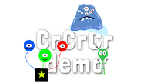
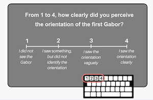
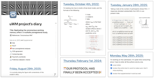
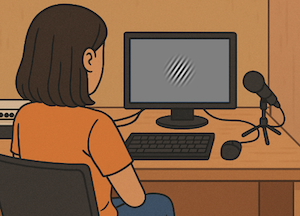
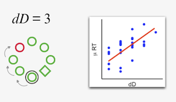
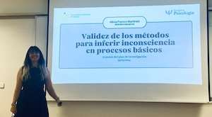
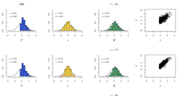
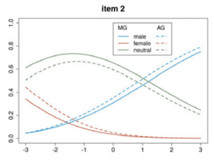
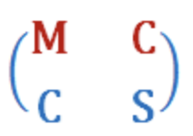
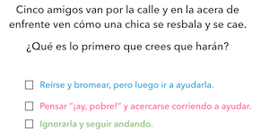

<!-- Versión en español de Researcher/Researcher.qmd. Si cambias algo allí, cámbialo también aquí. -->

```{=html}
<!-- Cabecera con vídeo -->
<div class="hero-video">
  <video autoplay muted loop playsinline>
    <source src="../../Researcher/assets/publications.mp4" type="video/mp4">
  </video>
  <div class="hero-text">
  <h1>Investigadora</h1>
    <p>Mi recorrido hasta ahora…</p>
  </div>
  <a class="drawer-launch" href="Drawer.html" aria-label="Abrir nuestro archivador">
    
    <span>Nuestro archivador</span>
  </a>
</div>


<div class="timeline">
  <div class="timeline-item left">
    <div class="timeline-content">
      <span class="short-title">
      
  Creative Creature Creator</span>
      <div class="full-text">
      
        <h3>En curso...</h3>
        <p><strong>Franco-Martínez et al. </strong><br>
        <a href="https://osf.io/preprints/psyarxiv/xkaw6_v1"
     target="_blank"
     title="Abrir artículo">
     🔗</a> 
     Measuring Creativity Process and Product with a Digitized Invented Alien Creatures Task.</p>
    </div>
  </div>
</div>


  <div class="timeline-item right">
    <div class="timeline-content">
      <span class="short-title">
      
  Tesis doctoral</span>
      <div class="full-text">
      
        <h3>2022-2026</h3>
        <p><strong>Alicia Franco-Martínez</strong><br>
        <a href=""
     target="_blank"
     title="Abrir artículo">
     🔗</a> 
     Be(a)ware of Validity: Inferences and Measures in Unconscious Processing Research.</p>
    </div>
  </div>
</div>

  <div class="timeline-item left">
    <div class="timeline-content">
      <span class="short-title">
      
  Validez de la PAS</span>
      <div class="full-text">
      
        <h3>En revisión...</h3>
        <p><strong>Franco-Martínez et al. </strong><br>
        <a href="https://osf.io/jd7ak/overview"
     target="_blank"
     title="Abrir artículo">
     🔗</a> 
     Choose your own PAS? Quantitative and qualitative validity evidence for the Perceptual Awareness Scale.</p>
    </div>
  </div>
</div>

  <div class="timeline-item right">
    <div class="timeline-content">
      <span class="short-title">
      
      Recursos para estudios multicéntricos</span>
      <div class="full-text">
      
      <h3>2026</h3>
      <p><strong>Franco-Martínez & Vadillo </strong><br> 
      <a href="https://doi.org/10.1525/collabra.159983"
     target="_blank"
     title="Abrir artículo">
     🔗</a> A gentle push toward leading your first multisite Registered Report: Resources and recommendations from an early-career coordinator</p>
    </div>
  </div>
</div>


  <div class="timeline-item left">
    <div class="timeline-content">
      <span class="short-title">
      
       Replicando el efecto de MT inconsciente</span>
      <div class="full-text">
      
      <h3>2026</h3>
      <p><strong>Franco-Martínez et al. </strong><br>
      <a href="https://academic.oup.com/nc/article-abstract/2026/1/niaf046/8429939"
     target="_blank"
     title="Abrir artículo">
     🔗</a> Replicating the unconscious Working Memory effect: A multisite Registered Report</p>
      <p><em>Neuroscience of Consciousness</em></p>
    </div>
  </div>
</div>

  <div class="timeline-item right">
    <div class="timeline-content">
      <span class="short-title">
      
      Proyecto COS</span>
      <div class="full-text">
      
      <h3>2022-2026</h3>
      <p><strong>Investigadora principal</strong> $36.813<br>
      <a href="https://osf.io/nz6m5/overview"
     target="_blank"
     title="Abrir enlace">
     🔗</a> Replicating the unconscious Working Memory effect: A multisite Registered Report</p>
      <p><a href="https://www.cos.io/consciousness"
     target="_blank"
     title="Abrir artículo">
     
     </a> <em>Center for Open Science</em></p>
    </div>
  </div>
</div>

  <div class="timeline-item left">
    <div class="timeline-content">
      <span class="short-title">
      
      Modelando el ruido de medida y de muestreo</span>
      <div class="full-text">
      
      <h3>2025</h3>
      <p><strong>Franco-Martínez et al. </strong><br>
        <a href="https://www.sciencedirect.com/science/article/pii/S0749596X25000142"
     target="_blank"
     title="Abrir artículo">
     🔗</a> Measurement and sampling noise undermine inferences about awareness in location probability learning
      <p><em>Journal of Memory and Language</em></p>
    </div>
  </div>
</div>

  <div class="timeline-item right">
    <div class="timeline-content">
      <span class="short-title">
      
      Empieza mi doctorado...</span>
      <div class="full-text">
      
      <h3>2022-2026</h3>
      <p><strong>FPI-MINECO</strong><br>
       </a>Validez de los métodos para inferir inconsciencia en procesos psicológicos
      <p><em>Universidad Autónoma de Madrid</em></p>
    </div>
  </div>
</div>

  <div class="timeline-item left">
    <div class="timeline-content">
      <span class="short-title">
      
      La restricción del rango afecta al análisis factorial</span>
      <div class="full-text">
      
      <h3>2023</h3>
      <p><strong>Franco-Martínez et al. </strong><br> 
        <a href="https://pubmed.ncbi.nlm.nih.gov/36866065/"
     target="_blank"
     title="Abrir artículo">
     🔗</a>Range Restriction affects Factor Analysis: Normality, estimation, fit, loadings, and reliability</p>
      <p><em>Educational and Psychological Measurement</em></p>
    </div>
  </div>
</div>

  <div class="timeline-item right">
    <div class="timeline-content">
      <span class="short-title">
      
      Análisis factorial nominal</span>
      <div class="full-text">
      
      <h3>2021</h3>
      <p><strong>Revuelta et al. </strong><br> 
        <a href="https://pubmed.ncbi.nlm.nih.gov/34565816/"
     target="_blank"
     title="Abrir artículo">
     🔗</a>Nominal Factor Analysis of Situational Judgment Tests: Evaluation of Latent Dimensionality and Factorial Invariance</p>
      <p><em>Educational and Psychological Measurement</em></p>
    </div>
  </div>
</div>
  
  
  <div class="timeline-item left">
    <div class="timeline-content">
      <span class="short-title">
      
      Máster en Metodología de las Ciencias del Comportamiento (UAM)</span>
      <div class="full-text">
      
      <h3>2014-2019</h3>
      <p><strong>Universidad Autónoma de Madrid </strong><br>
    </div>
  </div>
</div>

  
  <div class="timeline-item right">
    <div class="timeline-content">
      <span class="short-title">
      
      Genérico masculino</span>
      <div class="full-text">
      
      <h3>2019</h3>
      <p><strong>Franco-Martínez </strong><br>
        <a href="https://osf.io/7azfg/overview"
     target="_blank"
     title="Abrir artículo">
     🔗</a> ¿Todos, todos/as, todxs o todes? Efectos cognitivos del uso del genérico masculino y sus formas alternativas en español.</p>
      <p><em>Capítulo de libro: Egales</em></p>
    </div>
  </div>
</div>

  <div class="timeline-item left">
    <div class="timeline-content">
      <span class="short-title">
      
      Grado en Psicología (UAM)</span>
      <div class="full-text">
      
      <h3>2014-2019</h3>
      <p><strong>Universidad Autónoma de Madrid </strong><br>
    </div>
  </div>
</div>
</div>

<script src="../../Researcher/assets/timeline.js"></script>


```
