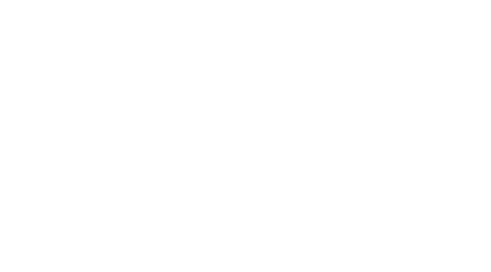
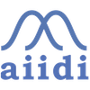
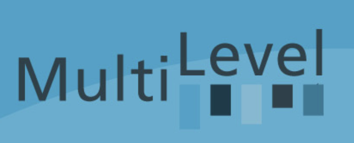
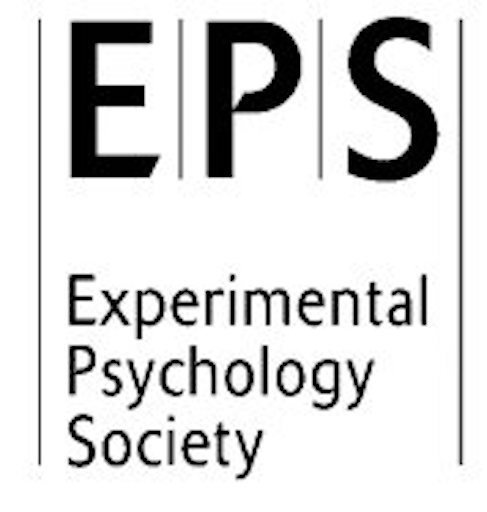

<!-- Versión en español de Visitor/Visitor.qmd. Si cambias algo allí, cámbialo también aquí. -->


```{=html}
<div id="map-stage" aria-label="Mapa panorámico interactivo">
  <div id="map-pan">
    <section class="map-tile" aria-hidden="false">
      

      <button class="marker congress" aria-label="Valencia" data-lat="33.4168" data-lon="-20.7038">
        <span class="dot" aria-hidden="true">
          <span class="marker-letter">C</span>
        </span>
        <span class="tip tip-congress">
          <span class="tip-congress-entry">
            
            <strong class="tip-title">EAM 2021 - Valencia</strong>
            <span class="tip-institution">Comunicación oral</span>
            <em class="tip-supervisor">Loading recovery and reliability in test-data under range restriction.</em>
            <span class="tip-institution">Comunicación oral</span>
            <em class="tip-supervisor">On the nature of group factors in bifactor structures.</em>
          </span>
        </span>
      </button>

      <button class="marker congress" aria-label="Madrid" data-lat="33.4168" data-lon="-25.7038">
        <span class="dot" aria-hidden="true">
          <span class="marker-letter">C</span>
        </span>
        <span class="tip tip-congress">
          <span class="tip-congress-entry">
            
            <strong class="tip-title">AIIDI 2025 - Madrid (UAM)</strong>
            <span class="tip-institution">Comunicación oral</span>
            <em class="tip-supervisor">Counterintuitive: Self-Reported Intuition in a Questionnaire fails to predict Behavioral Intuition</em>
          </span>
          <span class="tip-congress-entry">
            
            <strong class="tip-title">RECA 2025 - Madrid (UNED)</strong>
            <span class="tip-institution">Comunicación oral</span>
            <em class="tip-supervisor">Los ruidos de medida y de muestreo comprometen las inferencias de inconsciencia en el aprendizaje probabilístico</em>
          </span>
        </span>
      </button>

      <button class="marker congress" aria-label="Congreso en Nueva York" data-lat="35.7128" data-lon="-95.0060">
        <span class="dot" aria-hidden="true">
          <span class="marker-letter">C</span>
        </span>
        <span class="tip tip-congress">
          <span class="tip-congress-entry">
            
            <strong class="tip-title">ASSC 2023 - Nueva York</strong>
            <span class="tip-institution">Póster</span>
            <em class="tip-supervisor">Replicating the unconscious working memory effect: a preregistered multisite study</em>
          </span>
        </span>
      </button>

      <button class="marker congress" aria-label="Congreso en Tokio" data-lat="30.6762" data-lon="130.6503">
        <span class="dot" aria-hidden="true">
          <span class="marker-letter">C</span>
        </span>
        <span class="tip tip-congress">
          <span class="tip-congress-entry">
            
            <strong class="tip-title">ASSC 2024 - Tokio</strong>
            <span class="tip-institution">Póster</span>
            <em class="tip-supervisor">Advances in "Replicating the unconscious working memory effect: A multisite preregistered study."</em>
          </span>
        </span>
      </button>

      <button class="marker congress" aria-label="Congreso en Teruel" data-lat="34.3456" data-lon="-22.1065">
        <span class="dot" aria-hidden="true">
          <span class="marker-letter">C</span>
        </span>
        <span class="tip tip-congress">
          <span class="tip-congress-entry">
            
            <strong class="tip-title">AEMCCO 2022 - Teruel</strong>
            <span class="tip-institution">Comunicación oral</span>
            <em class="tip-supervisor">¿Cómo medir y modelar la consciencia en tareas de búsqueda visual?</em>
            <span class="tip-institution">Ponencia en simposio</span>
            <em class="tip-supervisor">Ya hice la ciencia, ¿ahora cómo la cuento?: desde los congresos científicos hasta las redes sociales.</em>
          </span>
        </span>
      </button>

      <button class="marker congress" aria-label="Congreso en Heraclión" data-lat="28.3387" data-lon="5.1442">
        <span class="dot" aria-hidden="true">
          <span class="marker-letter">C</span>
        </span>
        <span class="tip tip-congress">
          <span class="tip-congress-entry">
            
            <strong class="tip-title">ASSC 2025 - Heraclión</strong>
            <span class="tip-institution">Comunicación oral</span>
            <em class="tip-supervisor">Replicating the unconscious working memory effect: A multisite preregistered study.</em>
          </span>
        </span>
      </button>

      <button class="marker congress" aria-label="Congreso en Sevilla" data-lat="30.3891" data-lon="-27.9845">
        <span class="dot" aria-hidden="true">
          <span class="marker-letter">C</span>
        </span>
        <span class="tip tip-congress">
          <span class="tip-congress-entry">
            
            <strong class="tip-title">AEMCCO 2024 - Sevilla</strong>
            <span class="tip-institution">Premio a Jóvenes Investigadores</span>
            <em class="tip-supervisor">¿“El aprendizaje probabilístico es inconsciente”? Modelando mucho ruido y poca muestra</em>
          </span>
        </span>
      </button>

      <button class="marker congress" aria-label="Congreso en Tenerife" data-lat="20.4636" data-lon="-40.2518">
        <span class="dot" aria-hidden="true">
          <span class="marker-letter">C</span>
        </span>
        <span class="tip tip-congress">
          <span class="tip-congress-entry">
            
            <strong class="tip-title">EAM 2025 - Tenerife</strong>
            <span class="tip-institution">Comunicación oral</span>
            <em class="tip-supervisor">Choose your own PAS? Studying the validity of the Perceptual Awareness Scale</em>
          </span>
        </span>
      </button>

      <button class="marker congress" aria-label="Congreso en Utrecht" data-lat="45.7074" data-lon="-14.8">
        <span class="dot" aria-hidden="true">
          <span class="marker-letter">C</span>
        </span>
        <span class="tip tip-congress">
          <span class="tip-congress-entry">
            
            <strong class="tip-title">Multilevel Conference 2026 - Utrecht</strong>
            <span class="tip-institution">Comunicación oral</span>
            <em class="tip-supervisor">How do I start planning my multisite project? A tutorial on multilevel simulation-based power and sensitivity analysis</em>
          </span>
        </span>
      </button>

      <button class="marker congress" aria-label="Congreso en Londres" data-lat="46.2074" data-lon="-18.9278">
        <span class="dot" aria-hidden="true">
          <span class="marker-letter">C</span>
        </span>
        <span class="tip tip-congress">
          <span class="tip-congress-entry">
            
            <strong class="tip-title">EPS 2024 - Londres</strong>
            <span class="tip-institution">Comunicación oral</span>
            <em class="tip-supervisor">Modeling visual search and awareness in the additional singleton task</em>
          </span>
        </span>
      </button>

      <button class="marker visit" aria-label="Estancia en Londres" data-lat="47.0074" data-lon="-20.1278">
        <span class="dot" aria-hidden="true">
          <span class="marker-letter">V</span>
        </span>
        <span class="tip tip-visit">
          
          <strong class="tip-title">Estancia predoctoral · 2024 (3 meses)</strong>
          <span class="tip-institution">University College London (UCL)</span>
          <em class="tip-supervisor">Supervisada por David R. Shanks</em>
        </span>
      </button>

      <button class="marker visit" aria-label="Estancia en Ámsterdam" data-lat="47.7074" data-lon="-14.8">
        <span class="dot" aria-hidden="true">
          <span class="marker-letter">V</span>
        </span>
        <span class="tip tip-visit">
          
          <strong class="tip-title">Estancia de investigación · 2026 (3 meses)</strong>
          <span class="tip-institution">Universiteit van Amsterdam (UvA)</span>
          <em class="tip-supervisor">Supervisada por Makiko Sadakata</em>
        </span>
      </button>


    </section>

    <section class="map-tile" aria-hidden="true">
      
    </section>
  </div>

  <div id="map-controls" aria-label="Controles del mapa">
    <label class="zoom-control" for="map-zoom">Zoom</label>
    <input id="map-zoom" type="range" min="1" max="4.8" step="0.01" value="1.7" aria-label="Ampliar o reducir el mapa">
    <div class="drag-hint" aria-hidden="true">
      <svg viewBox="0 0 24 24" role="img">
        <path d="M12 2l2.3 2.3L13 5.6V8h2.4l1.3-1.3L19 9l-2.3 2.3L15.4 10H13v4h2.4l1.3-1.3L19 15l-2.3 2.3-1.3-1.3H13v2.4l1.3 1.3L12 22l-2.3-2.3 1.3-1.3V16H8.6l-1.3 1.3L5 15l2.3-2.3L8.6 14H11v-4H8.6l-1.3 1.3L5 9l2.3-2.3L8.6 8H11V5.6L9.7 4.3 12 2z"/>
      </svg>
      <span>Arrastra el mapa</span>
    </div>
  </div>
</div>

<script src="../../Visitor/assets/map.js"></script>

```
