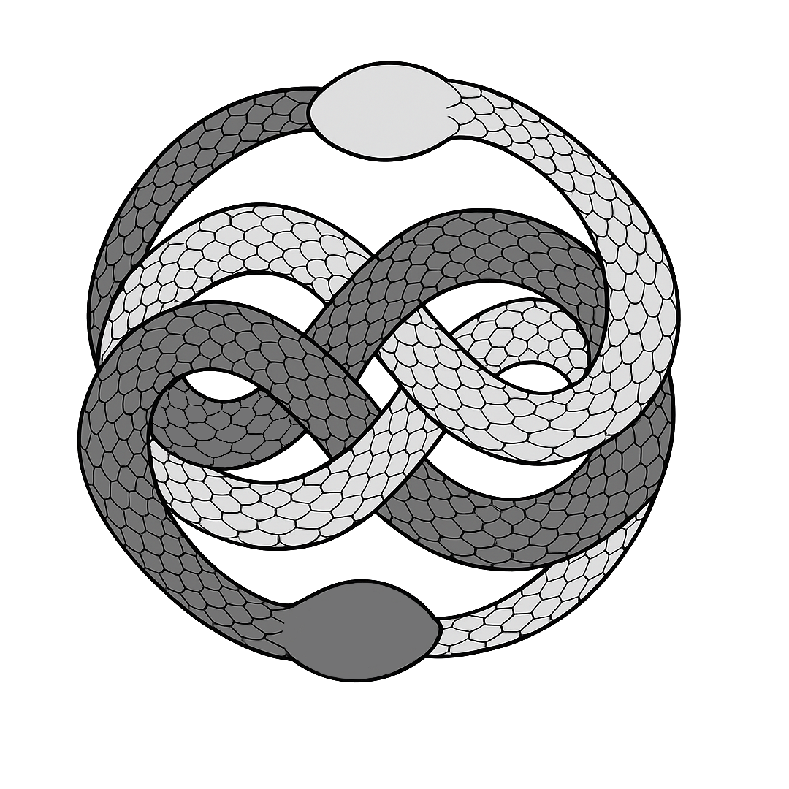
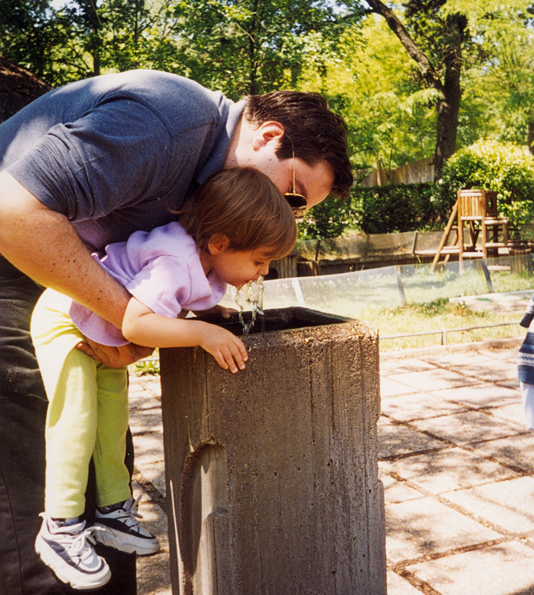
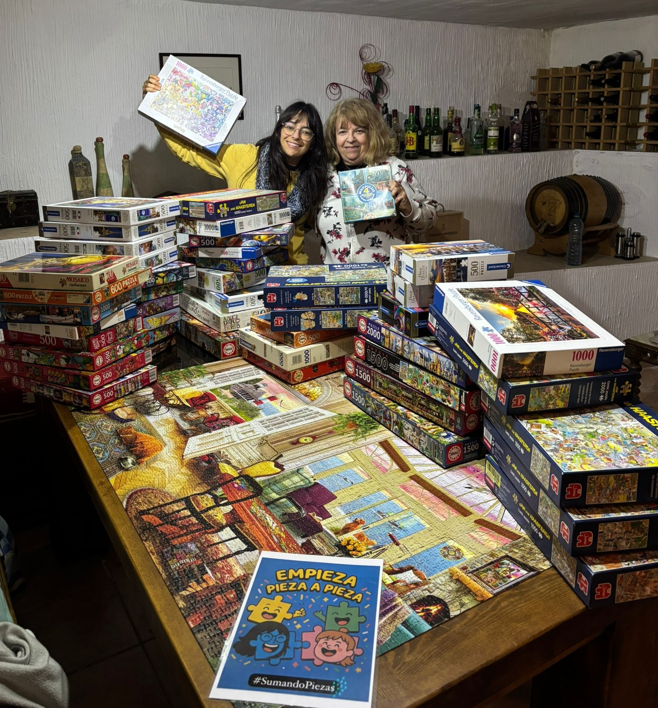
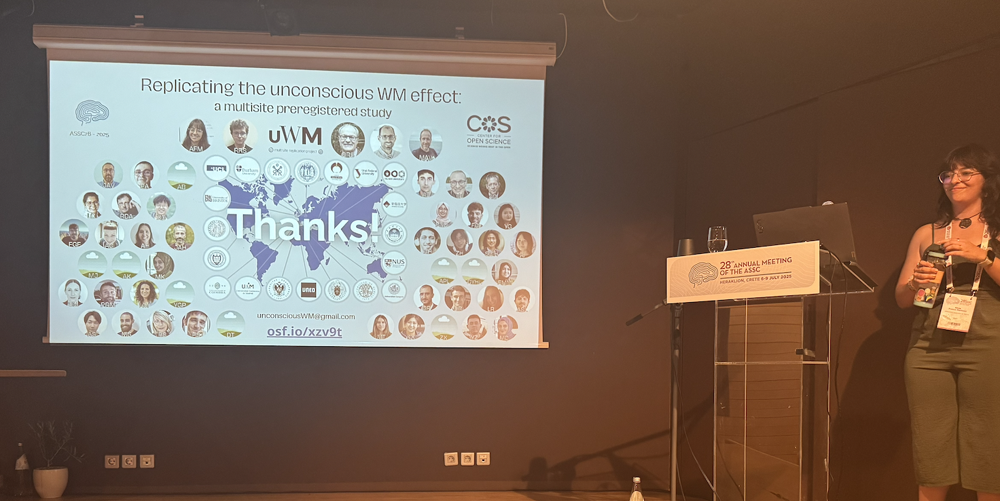
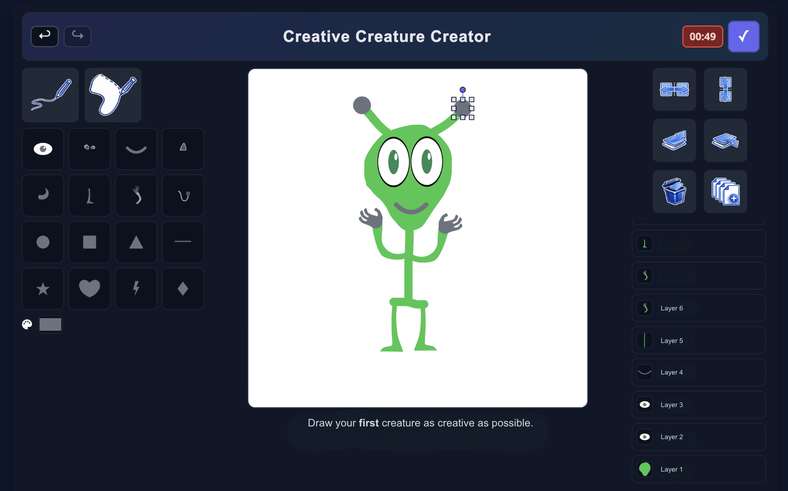

<!-- Versión en español de index.qmd. Si cambias algo allí, cámbialo también aquí. -->


```{=html}
<div class="hero-video">
  <video autoplay muted loop playsinline>
    <source src="../assets/prueba.mp4" type="video/mp4">
  </video>
  <div class="hero-text">
    <p>Doctoranda</p>
  <h1>
  Alicia
  <span>Franco-Martínez</span>
  </h1>
    <p>Psicometría y Estadística</p>
    <p>Ciencia Abierta Colaborativa</p>
  </div>
</div>
```

```{=html}
<section class="person-story-wrap">
  <div class="person-border-logos" aria-hidden="true">
    
    
    
    
    
    
    
    
    
    
    
    
    
    
    
    
  </div>
  <div class="person-story-card">
    
    <h2>¡Te doy la bienvenida a mi NeverEnding web!</h2>
    <div class="story-row story-row-sides">
      
      <p>Este espacio quiere ser una pequeña presentación de quién soy y de lo que me encanta hacer. Crecí escuchando a mi padre hablar de ciencia con auténtica fascinación y, como era inevitable, me contagió esa pasión. De mi madre heredé, sin duda, la creatividad: una preferencia constante por las ideas llenas de color y el instinto de romper el formato siempre que puedo. Hoy me siento increíblemente afortunada de poder decir que dedico mi tiempo al trabajo de mis sueños.</p>
      
    </div>

    <div class="story-row story-row-top-center">
      <p>Mi camino empezó en la Psicología, me llevó de lleno a la Psicometría y la Medición y, más tarde, casi por sorpresa, a la Psicología Experimental y a la Ciencia Abierta y Colaborativa. Ese recorrido es el que ha hecho de mí la científica que soy hoy, todavía al principio de mi carrera.</p>
      
    </div>

    <div class="story-row story-row-top-center">
      <p>Hace unos meses terminé el doctorado. Durante estos cuatro años fantásticos tuve el privilegio de coordinar un Registered Report internacional con 19 laboratorios como investigadora principal del proyecto. Cada paso era nuevo, exigente y a veces intimidante, pero gracias al mejor director de tesis y a los mejores compañeros, todo salió sorprendentemente bien.</p>
      
    </div>

    <p>Ahora tengo muchas ganas de adentrarme en el terreno desconocido de la vida posdoctoral y de intentar liderar mis propios proyectos. El primero se centrará en estudiar los efectos de la música de fondo sobre la creatividad. Por eso digitalicé una tarea clásica de creatividad llamada Invented Alien Creatures. Ya puedes jugar con nuestra demo: <a href="https://aliciafrancomartinez.github.io/demoCrCrCr.github.io/" target="_blank" rel="noopener">https://aliciafrancomartinez.github.io/demoCrCrCr.github.io/</a>.</p>

    <p>Pasea con libertad por esta web, a veces desordenada y nunca del todo terminada. ¡Y no dudes en escribirme si quieres ponerte en contacto!</p>

    <section class="person-contact-panel" aria-label="Enlaces de contacto">
      <p class="person-contact-email">
        
        <a href="mailto:aliciafrancomartinez96@gmail.com">aliciafrancomartinez96@gmail.com</a>
      </p>
      <div class="person-contact-links">
        <a class="person-contact-link" href="https://bsky.app/profile/aliciafrancomnez.bsky.social" target="_blank" rel="noopener">
          
          <span>Bluesky</span>
        </a>
        <a class="person-contact-link" href="https://www.researchgate.net/profile/Alicia-Franco-Martinez" target="_blank" rel="noopener">
          
          <span>ResearchGate</span>
        </a>
        <a class="person-contact-link" href="https://orcid.org/0000-0002-9710-1240" target="_blank" rel="noopener">
          
          <span>ORCID</span>
        </a>
        <a class="person-contact-link" href="https://osf.io/fr53n/" target="_blank" rel="noopener">
          
          <span>OSF</span>
        </a>
        <a class="person-contact-link" href="https://github.com/AliciaFrancoMartinez" target="_blank" rel="noopener">
          <svg viewBox="0 0 24 24" aria-hidden="true" focusable="false" style="color:#111111;">
            <path fill="currentColor" d="M12 .5C5.65.5.5 5.66.5 12.02c0 5.09 3.29 9.41 7.86 10.94.57.11.78-.25.78-.55 0-.27-.01-.99-.02-1.95-3.2.7-3.87-1.54-3.87-1.54-.52-1.34-1.28-1.69-1.28-1.69-1.04-.72.08-.71.08-.71 1.15.08 1.75 1.18 1.75 1.18 1.02 1.76 2.68 1.25 3.33.96.1-.74.4-1.25.72-1.53-2.55-.29-5.23-1.28-5.23-5.68 0-1.25.45-2.27 1.17-3.07-.12-.29-.51-1.46.11-3.05 0 0 .96-.31 3.13 1.17a10.9 10.9 0 0 1 5.69 0c2.17-1.48 3.13-1.17 3.13-1.17.62 1.59.23 2.76.11 3.05.73.8 1.17 1.82 1.17 3.07 0 4.41-2.68 5.38-5.24 5.67.41.36.78 1.06.78 2.15 0 1.55-.01 2.8-.01 3.18 0 .31.21.67.79.55a11.52 11.52 0 0 0 7.85-10.94C23.5 5.66 18.35.5 12 .5Z"/>
          </svg>
          <span>GitHub</span>
        </a>
      </div>
    </section>
  </div>
</section>
```

```{=html}
<section class="person-auryn-loop" aria-label="Bucle infinito">
  <div class="auryn-stage">
    
  </div>
</section>

<script src="../assets/home.js"></script>
```
