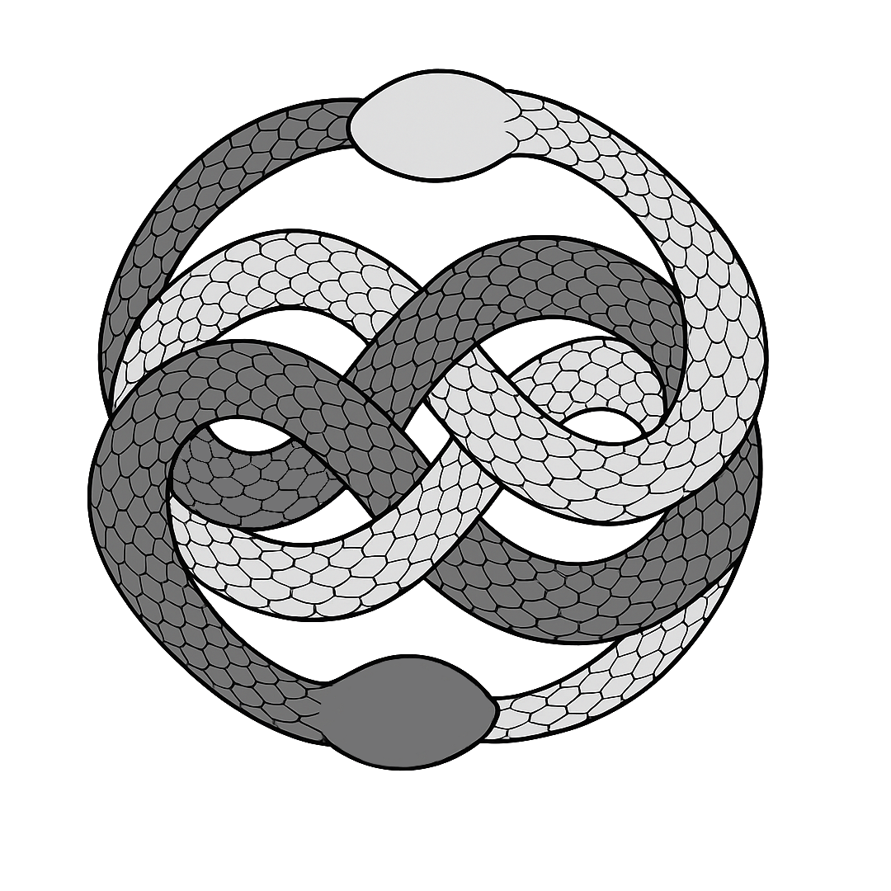
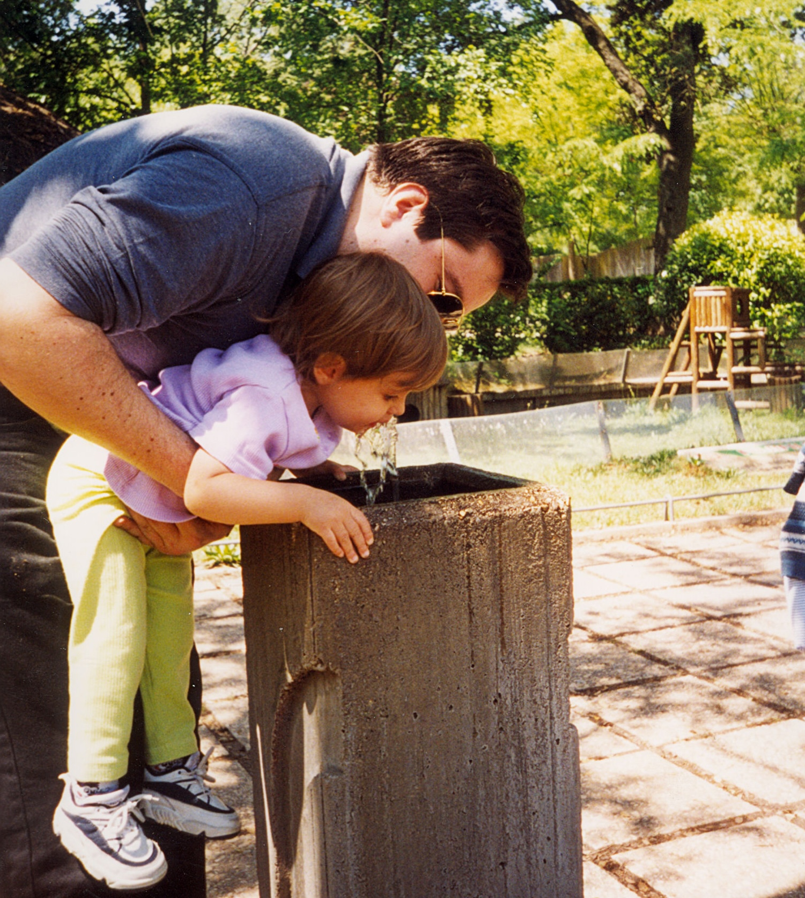
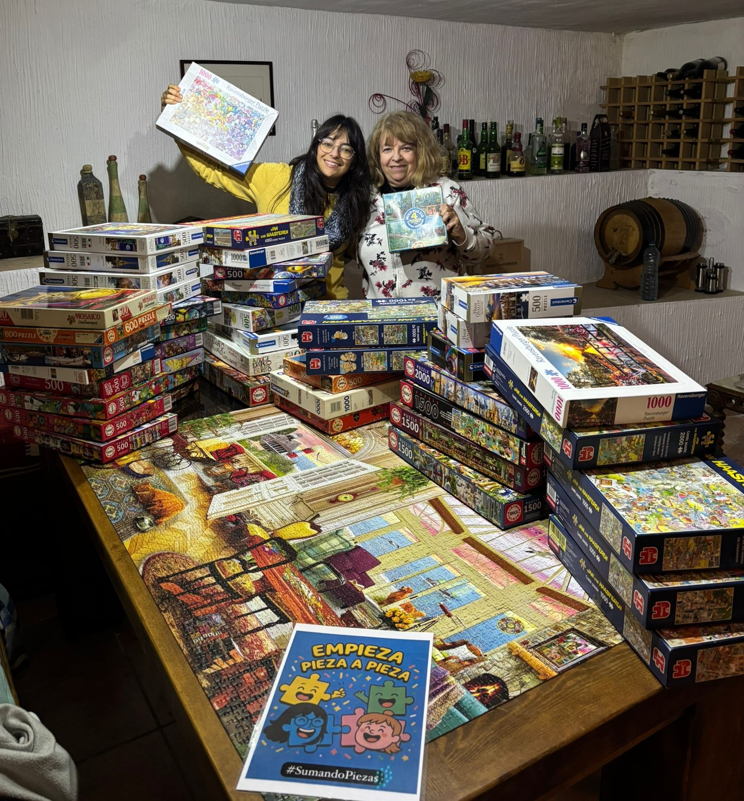
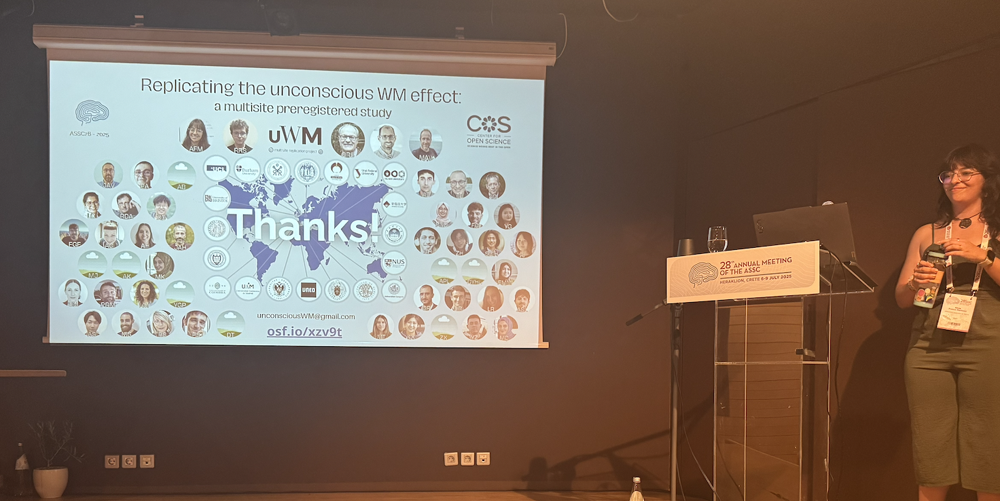
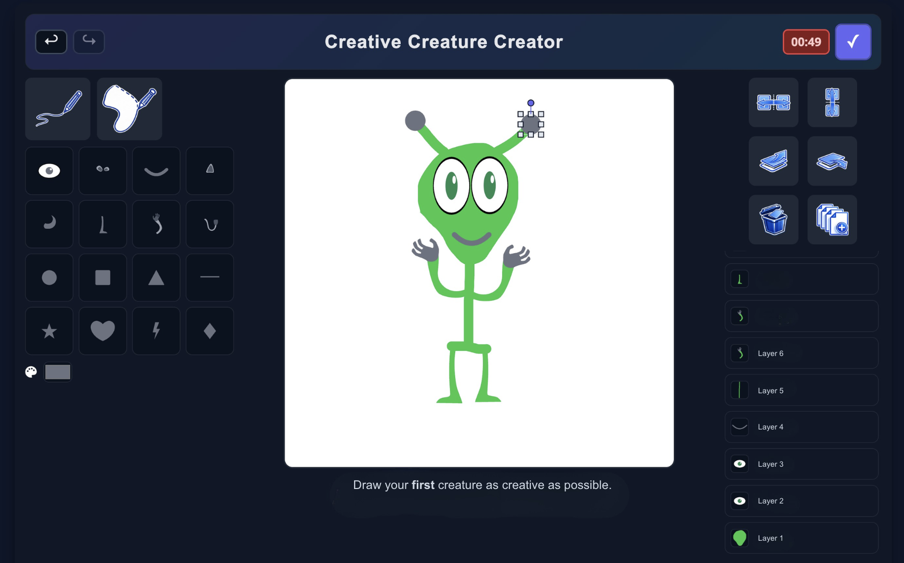

```{=html}
<div class="hero-video">
  <video autoplay muted loop playsinline>
    <source src="assets/prueba.mp4" type="video/mp4">
  </video>
  <div class="hero-text">
    <p>PhD candidate</p>
  <h1>
  Alicia
  <span>Franco-Martínez</span>
  </h1>
    <p>Psychometrics & Stats</p>
    <p>Collaborative Open Science</p>
  </div>
</div>
```

```{=html}
<section class="person-story-wrap">
  <div class="person-border-logos" aria-hidden="true">
    
    
    
    
    
    
    
    
    
    
    
    
    
    
    
    
  </div>
  <div class="person-story-card">
    
    <h2>Welcome to my NeverEnding web!</h2>
    <div class="story-row story-row-sides">
      
      <p>This space is meant to be a small presentation of who I am and what I love doing. I grew up listening to my father talk about science with genuine fascination, and inevitably, he passed that passion on to me. From my mother, I definitely inherited my creativity: a constant preference for colorful ideas and the instinct to break the format whenever possible. Today, I feel incredibly lucky to say that I get to dedicate my time to the job of my dreams.</p>
      
    </div>

    <div class="story-row story-row-top-center">
      <p>My path started in Psychology, then took me deep into Psychometrics and Measurement, and later brought me, almost by surprise, to Experimental Psychology and Open and Collaborative Science. That journey is what has shaped me into the early-career scientist I am today.</p>
      
    </div>

    <div class="story-row story-row-top-center">
      <p>I am now about to finish my PhD. During these four fantastic years, I had the privilege of coordinating a worldwide 19-lab Registered Report while serving as the PI of the project. Every step was new, challenging, and sometimes intimidating, but thanks to the best supervisor and colleagues, everything went surprisingly well.</p>
      
    </div>

    <p>Now, I am eager to step into the unknown terrain of postdoctoral life and try leading my own projects. My first attempt will focus on studying the effects of background music on creativity. That's why I digitized a classic creativity task called Invented Alien Creatures. You can already play with our demo: <a href="https://aliciafrancomartinez.github.io/demoCrCrCr.github.io/" target="_blank" rel="noopener">https://aliciafrancomartinez.github.io/demoCrCrCr.github.io/</a>.</p>

    <p>Feel free to wander around this sometimes messy, never quite ended website. And don't hesitate to contact me if you'd like to get in touch!</p>

    <section class="person-contact-panel" aria-label="Contact links">
      <p class="person-contact-email">
        
        <a href="mailto:aliciafrancomartinez96@gmail.com">aliciafrancomartinez96@gmail.com</a>
      </p>
      <div class="person-contact-links">
        <a class="person-contact-link" href="https://bsky.app/profile/aliciafrancomnez.bsky.social" target="_blank" rel="noopener">
          
          <span>Bluesky</span>
        </a>
        <a class="person-contact-link" href="https://www.researchgate.net/profile/Alicia-Franco-Martinez" target="_blank" rel="noopener">
          
          <span>ResearchGate</span>
        </a>
        <a class="person-contact-link" href="https://orcid.org/0000-0002-9710-1240" target="_blank" rel="noopener">
          
          <span>ORCID</span>
        </a>
        <a class="person-contact-link" href="https://osf.io/fr53n/" target="_blank" rel="noopener">
          
          <span>OSF</span>
        </a>
        <a class="person-contact-link" href="https://github.com/AliciaFrancoMartinez" target="_blank" rel="noopener">
          <svg viewBox="0 0 24 24" aria-hidden="true" focusable="false" style="color:#111111;">
            <path fill="currentColor" d="M12 .5C5.65.5.5 5.66.5 12.02c0 5.09 3.29 9.41 7.86 10.94.57.11.78-.25.78-.55 0-.27-.01-.99-.02-1.95-3.2.7-3.87-1.54-3.87-1.54-.52-1.34-1.28-1.69-1.28-1.69-1.04-.72.08-.71.08-.71 1.15.08 1.75 1.18 1.75 1.18 1.02 1.76 2.68 1.25 3.33.96.1-.74.4-1.25.72-1.53-2.55-.29-5.23-1.28-5.23-5.68 0-1.25.45-2.27 1.17-3.07-.12-.29-.51-1.46.11-3.05 0 0 .96-.31 3.13 1.17a10.9 10.9 0 0 1 5.69 0c2.17-1.48 3.13-1.17 3.13-1.17.62 1.59.23 2.76.11 3.05.73.8 1.17 1.82 1.17 3.07 0 4.41-2.68 5.38-5.24 5.67.41.36.78 1.06.78 2.15 0 1.55-.01 2.8-.01 3.18 0 .31.21.67.79.55a11.52 11.52 0 0 0 7.85-10.94C23.5 5.66 18.35.5 12 .5Z"/>
          </svg>
          <span>GitHub</span>
        </a>
      </div>
    </section>
  </div>
</section>
```
